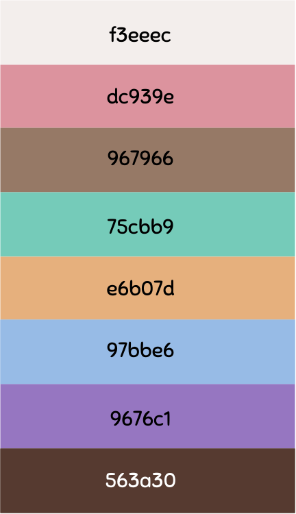
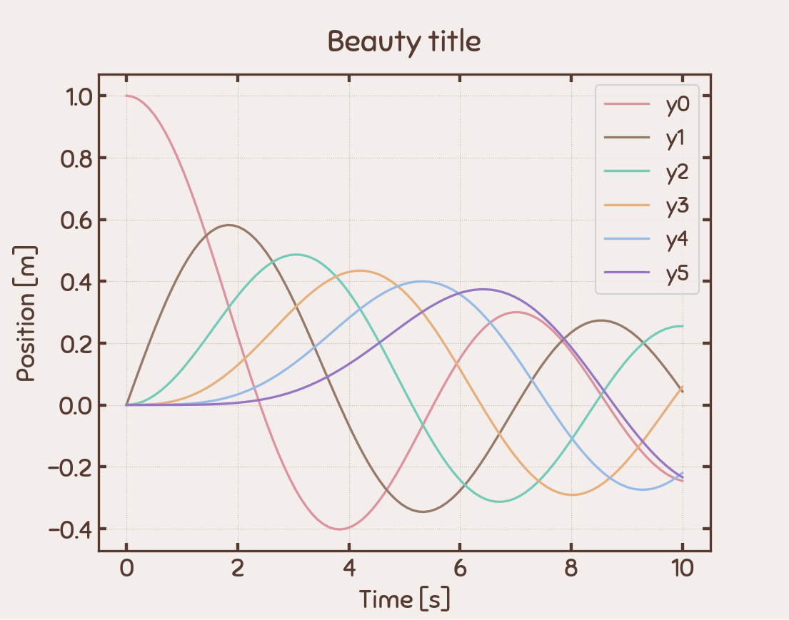
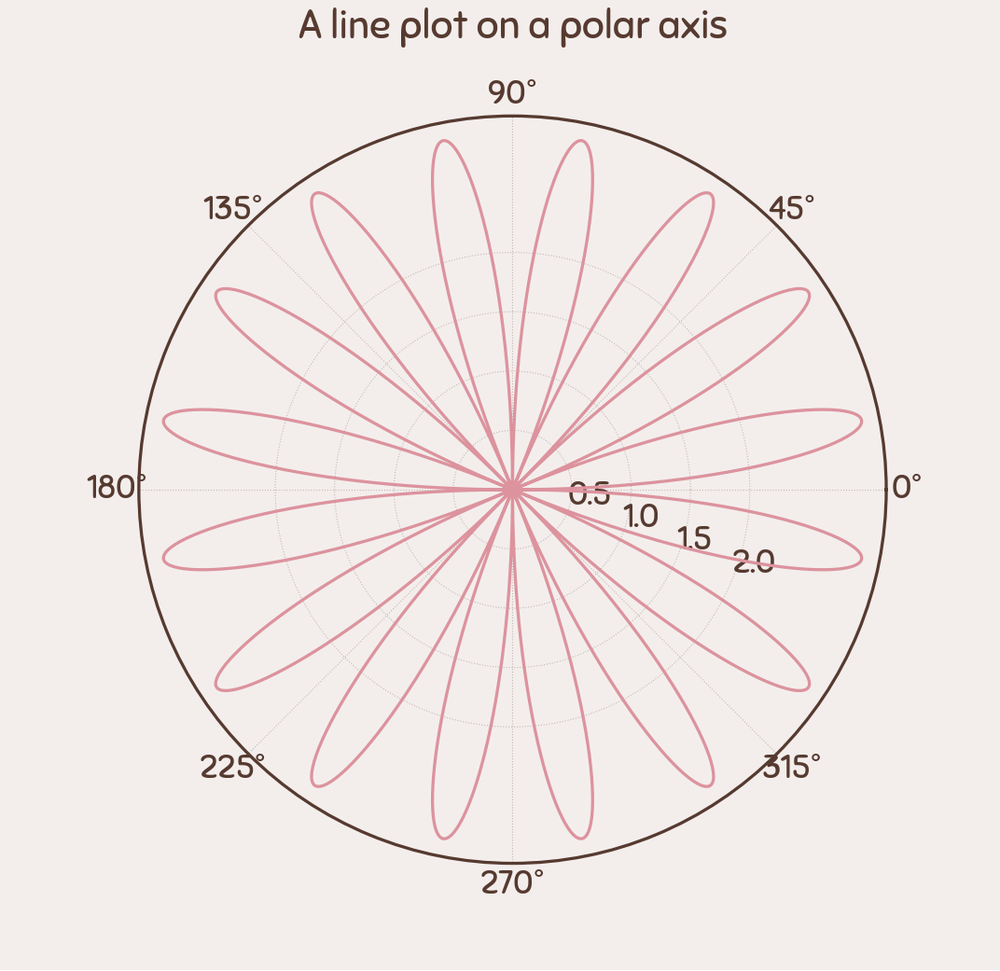
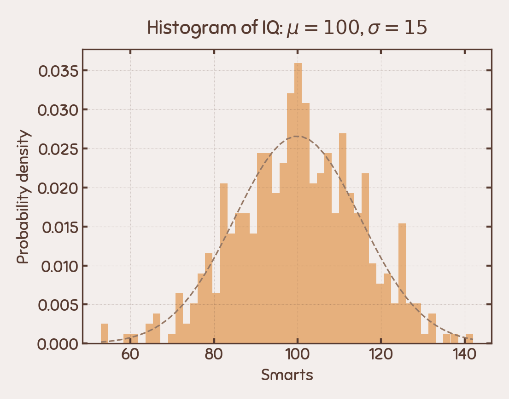

# Pusheen Theme :smiley_cat:  


This theme was created inspirated by Pusheen the cat to use in matplotlib.

## Requisites: :pencil:
- matplotlib version: 3.7.1  
	How to check my matplotlib version?  
	`import matplotlib`  
	`print(matplotlib.__version__)`
	
## Install: :gear: 
- Download fonts: [Sniglet](https://fonts.google.com/specimen/Sniglet)
		& [Creativo](https://www.dafont.com/es/creativo.font)
- Install fonts: Unzip and save in your `.fonts` directory. If you have problems you can visit [this site](https://scentellegher.github.io/visualization/2018/05/02/custom-fonts-matplotlib.html)

### Use style from GitHub:   
You can import the theme with:
```python 
plt.style.use('https://github.com/Jessi-MM/Matplotlib_Pusheen_Theme/raw/main/src/pusheen.mplstyle')
```
This is an example of complete code:

```python
import numpy as np
import matplotlib.pyplot as plt
from scipy.special import jv

plt.style.use('https://github.com/Jessi-MM/Matplotlib_Pusheen_Theme/raw/main/src/pusheen.mplstyle')

fig, ax = plt.subplots()
x = np.linspace(-10, 10, 100)

for i in range(0, 3):
  J = jv(i, x)
  ax.plot(x, J)

plt.show()
```

### Install the theme locally: :computer: 
1. Identify your matplotlib configuration directory:
```
import matplotlib as mpl
print(mpl.get_configdir())
```
2. Here, create a subdirectory called `stylelib`
3. Save the [pusheen.mplstyle](./src/pusheen.mplstyle)
4. You can use the theme with:
`plt.style.use('pusheen')`  
You can find examples of codes [here](./src/codes)

## Palette of colours :rainbow:  


## Examples  






		 


